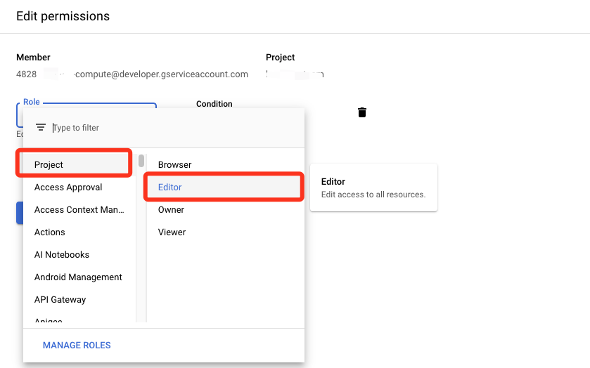
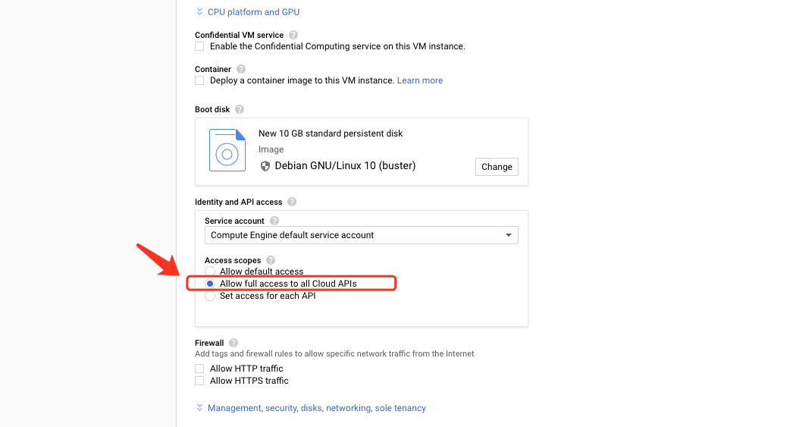

# Auto Translate and add caption to video on Google Cloud  
# 利用谷歌云为视频添加翻译字幕
## For Serverless version
For long term running, strongly recommended to the Serverless version, please refer to [this link](./Serverless/README.md)  
如果要长期部署，强烈建议使用无服务器版本，请访问[this link](./Serverless/README.md)  

## For running on a Virtual Machine Server (GCE)
Below is the description of simple application running on a server.  
以下是在服务器上手工运行的版本  
  
This tool generates translated caption for video with ONE COMMAND, and optional hard encoding caption into video.  
此工具只需一个命令，就可为视频生成你指定翻译语言的字幕文件，并可选自动硬编码入视频  
* Auto extract audio track from Video, auto detect the sample rate and channels count.  
从视频自动提取音轨，自动检测音频采样率和声道数量  
* Transcribe audio into text caption with Google Cloud Speech-to-Text API Service, and add caption time stamp.  
利用谷歌云Speech-to-Text API将音频转译成文本，并加入字幕时间戳  
* Translate source text into target language with Google Cloud Translation API Service.  
利用谷歌云Translation API将文本翻译为指定语言  
* Transform text back to caption file format.  
转换文本为字幕格式  
* Hard merging caption into video. This step is optional to choose.  
把字幕硬编码进视频中   
* The best feature is that the processing is in BATCH and in PARALLEL.  
最棒的是，支持批量并行处理

## Quick Guide on Windows VM with GUI
1. Create a Bucket, e.g. my-video-bucket.  
Upload some video files to GCS(Google Cloud Storage) Bucket, e.g. mp4, avi and etc.

2. Download [zip package for Windows](./win64/videosub.zip), unzip and run videosub.exe  


## Quick Guide on Linux VM without GUI
1. Create a Bucket, e.g. my-video-bucket.  
Upload some video files to GCS(Google Cloud Storage) Bucket, e.g. mp4, avi and etc.
2. Create VM at the same region as GCS Bucket. Set Cloud API Access Scope for all API.  
Use the default compute service account for the VM as project Editor permission.
3. Run these on the VM that you created:
    ```
    sudo apt update -y
    sudo apt install git python3-pip ffmpeg fonts-wqy-zenhei -y
    git clone https://github.com/hawkey999/trans_video_subs.git
    cd trans_video_subs
    pip3 install -r requirements.txt --user
    ```
4. Then run:
    ```
    python3 videosub.py --bucket my-video-bucket \
        --video_src_language en-US \
        --translate_src_language en \
        --translate_des_language zh \
        --merge_sub_to_video True \
        --parallel_threads 3
    ```
5. Translated caption and output video files will be in the GCS Bucket: my-video-bucket-out

## Detail Guide
1. Upload video files to GCS(Google Cloud Storage)  
上传视频到对象存储 
* All video files should be upload to GCS Bucket without sub-folder. The tool doesn't support sub-folder yet, and will be added in coming release.  
所有视频文件上传到GCS存储分区，并且没有子目录。本工具暂时不支持子目录，会在后续版本提供。  
* In case of filename with special character, the tool will change filename to underline _ in your source input bucket and then start processing caption. Special character including: / \ : * ? " < > | [] ' @  
对于文件名有特殊字符的，本工具会自动把GCS上的原文件改名后再开始后续处理，特殊字符修改为下划线 _。特殊字符包括 / \ : * ? " < > | [] ' @
___
2. Prepare tool execution environment  
准备程序运行环境
* Confirm IAM Service Account for the Server to execute tool with permissions of GCS Read/Write，Speech-to-Text API, Translation API. Or just use default compute service account with Edit permission of the project.     
确认执行程序所需的IAM服务账号，需要权限至少包括：GCS读写，Speech-to-Text API, Translation API。或使用默认的 compute 服务账号，自带有整个项目的 Edit 权限。  


* Create VM Instance on Google Cloud.  
在谷歌云上启动虚机服务器。  
    - Region: Select VM running on the same region as GCS bucket with your video  
    选择虚机运行在跟上传视频的GCS在同一个Region。  
    - Identity and API access: Select the Service Account as you confirm above  
    选择你上面确认的服务账号  
    - Access scopes: Allow full access to all Cloud APIs  
    允许访问全部API。事实上有Service Account限制权限了，这个Access Scope是旧功能，可以全放开。

    - Disk size: Shoud 2.2x large as single video. If process in parallel N video, disk size 2.2 x N x SingleMaxVideoFileSize
    硬盘大小要至少比单个视频的2.2倍要大，如果是并行处理N个视频，则需要硬盘空间为 2.2 x N x 单个最大视频文件大小。例如视频文件每个都是1GB，你设置了并行处理3个视频，则需要硬盘6.6GB以上。

* If you run this processing tool on other machine, e.g. on-premises or other cloud. You need to download IAM Service Account credential file to your machine and setup environment variable as below. Refer to [Authenticating as a service account Document](https://cloud.google.com/docs/authentication/production)  
如果不在谷歌云上运行虚机，而是在你自己的服务器或其他云，则需要自行下载IAM服务账号的密钥到你的服务器，并且设置环境变量如下。参见[以服务帐号身份进行身份验证文档](https://cloud.google.com/docs/authentication/production)
    ```
    export GOOGLE_APPLICATION_CREDENTIALS="/home/user/Downloads/my-key.json"  
    ```

* Run below install commands on your Server:  
在服务器运行以下安装命令安装FFMPEG和字体，并下载本工具的代码:   
    ```
    sudo apt update -y
    sudo apt install git python3-pip ffmpeg fonts-wqy-zenhei -y
        # If not running on Debian, but on MacOS, then use Brew: brew install git python3-pip ffmpeg
    git clone https://github.com/hawkey999/trans_video_subs.git
    cd trans_video_subs
    pip3 install -r requirements.txt --user
    ```
___
3. Execution 
* Run
    ```
    python3 videosub.py --bucket [String] \
        --video_src_language [String] \
        --translate_src_language [String] \
        --translate_des_language [String] \
        --merge_sub_to_video [Bool] \
        --parallel_threads [Int]
    ```
* Parameter specification
    - **--bucket**: Required.  
    The GCS bucket where you upload your video files
    - **--video_src_language**: Optional, default en-US.  
    Video language code. Refer to [Speech-to-Text API language code document](https://cloud.google.com/speech-to-text/docs/languages)
    - **--translate_src_language**: Optional, default en.  
    Translate from translate_src_language to translate_des_language. Refer to [Translate API language code document](https://cloud.google.com/translate/docs/languages)
    - **--translate_des_language**: Optional, default zh.
    - **--translate_location**: Optional, default us-central1.   
    Where to run the Translation API. "global" is not supported for batch translate. Recommand to select the same region as the VM you created.
    - **--merge_sub_to_video**: Optional, default True   
    True means automatically hard encode the srt caption into Video, as well as output the srt caption file. False means only output the srt caption file.
    - **--parallel_threads**: Optional, default 1  
    How many video files will be processed in parallel on the VM. 
    - **--two_step_convert**: Optional, default False   
    If you want to modify the caption before merge into video, you can set this para to "first", after run the app you can change the srt file and then rerun the app with "second"
    - **--gui**: Optional, Enable GUI  

* Example command:
    ```
    python3 videosub.py --bucket my-video-bucket \
        --video_src_language en-US \
        --translate_src_language en \
        --translate_des_language zh \
        --merge_sub_to_video True \
        --parallel_threads 3
    ```
___
4. Get result 查看结果
* The output caption and video files will be in the output GCS bucket, which name as [YOUR_ORIGINAL_BUCKET]-out. For example, your original video upload to bucket named "myvideo", then the ouput files will be in "myvideo-out". There is a temporay bucket name "-tmp", you can delete it.  
字幕和视频文件输出到了GCS，Bucket 名称为你原来Bucket名称后面加-out。还有一个-tmp的临时Bucket，你可以自行删除。

## TODO:
* Sub-folder in GCS

## Remark
* This Trans_video_subs project is programed by James Huang. Reference to the [Google Cloud Tutorial](https://cloud.google.com/community/tutorials/speech2srt). The Tutorial needs 20+ manual steps to process one video and without merger subs into video. Trans_video_subs make all steps auto including merging video and processing files in parallel.  
本项目参考了[Google Cloud Tutorial](https://cloud.google.com/community/tutorials/speech2srt)，原教程需要20多个手工步骤才能输出一个视频字幕，而且没有从视频提取音频，最终字幕加入视频的操作也没有。本项目把以上所有工作全自动化，也包括视频处理，并且是并行多文件处理。

* 对于日文Speech-to-Text的时候，会以｜分割同时给出平假名（左）和片假名（右），当前代码的处理是只取了左边的平假名来提交翻译。

* 2022.04月 Goolge Speech-to-Text 更新了latest_long算法，针对非英语的video，采用latest_long算法结果有明显改善。[Blog](https://cloud.google.com/blog/products/ai-machine-learning/google-cloud-updates-speech-api-models-for-improved-accuracy)，和[参考文档](https://cloud.google.com/speech-to-text/docs/latest-models)